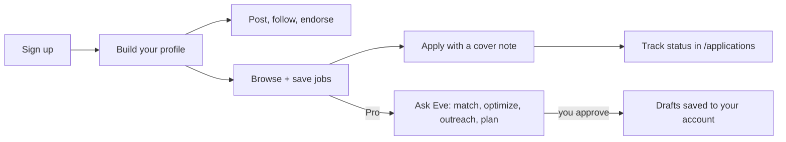
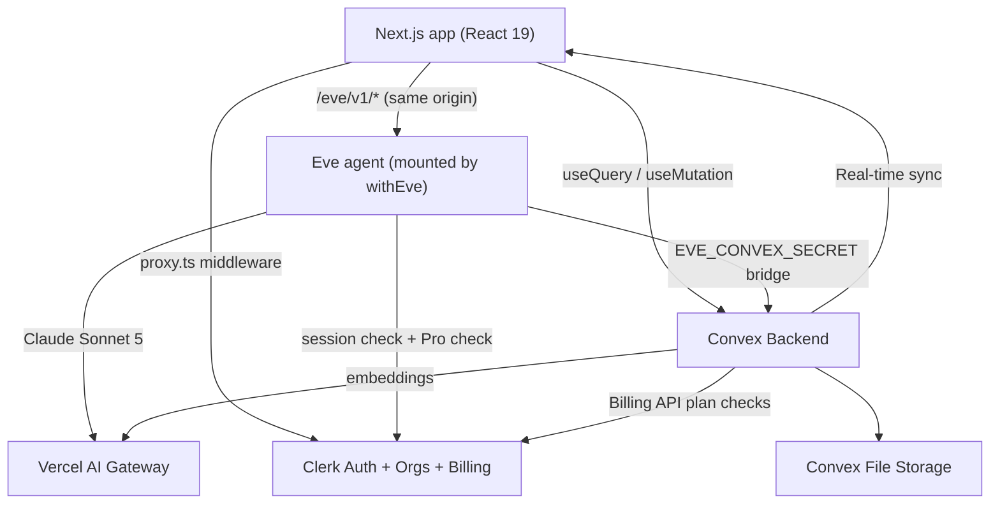

# CareerConnect — AI-Powered Professional Network (LinkedIn-style) with an AI Career Agent

[](https://nextjs.org/)
[](https://convex.dev/referral/SONNYS4371)
[](https://go.clerk.com/FVwCXg3)
[](https://vercel.com/)
[](https://vercel.com/docs/ai-gateway)
[](https://tailwindcss.com/)
[](https://www.typescriptlang.org/)

> **⚠️ Disclaimer:** This is an **educational project** built for learning purposes only. "CareerConnect" is a fictional name used for this demo — we do not claim any trademark or intellectual property rights over it. This project is **not affiliated with, endorsed by, or connected to LinkedIn, Microsoft, Indeed, Glassdoor, or any other professional network or job platform**. All companies (Vercept, Synthiel AI, Loomcast…), people, jobs, and posts in the seed data are entirely fictional. Third-party service names (Clerk, Convex, Vercel, Next.js, Anthropic, Tailwind CSS, etc.) are trademarks of their respective owners and are used here solely to describe the technologies used in this project.

A full-stack, real-time **LinkedIn-style professional network** — a two-sided SaaS where **job seekers** build a profile, post to a feed, and apply to jobs, **companies** hire through an org-powered dashboard with an applicant pipeline, and **Pro** users unlock **Eve**, an AI Career Agent that optimizes profiles, matches jobs, drafts recruiter outreach, and builds 30/60/90-day career plans — grounded in real data, with **human approval before anything is saved**.

> **Who is this for?**
> Anyone who wants to learn how to build a production-grade, two-sided SaaS with real B2C **and** B2B billing, an embedded AI agent, and a real-time backend using modern tools — or anyone looking for a serious starter template for their own career/jobs product.

> **What makes it different?**
> Every feed, inbox, and pipeline is **real-time** (no polling, no socket server to run). Auth, organizations, AND two-sided billing are handled by **Clerk** — no Stripe wiring required. The backend is powered by **Convex** — a reactive database that pushes changes to every connected client instantly. And the AI isn't a chat gimmick: **Eve** (a Vercel Eve agent running *inside* the Next.js app) reads the user's real profile and real jobs through a secret-guarded Convex bridge, and every save is **approval-gated** — the human clicks approve before anything persists.

> **Under the hood**
> Next.js 16 App Router (React 19 + React Compiler) · Convex reactive backend + file storage · Clerk auth + organizations + B2C/B2B billing · Vercel Eve agent (Claude Sonnet 5 via AI Gateway) · Vector embeddings for job matching (`text-embedding-3-small`) · shadcn/ui (Base UI) + Tailwind CSS v4 · TypeScript strict mode

---

## 👇🏼 DO THIS Before You Get Started

You'll need free accounts on these services to run the app. **Set them up before cloning:**

| Service                 | What it does                                                     | Sign up                                                                   |
| ----------------------- | ---------------------------------------------------------------- | ------------------------------------------------------------------------- |
| **Clerk**               | Authentication, organizations, and B2C + B2B subscription billing | [Create a free Clerk account →](https://go.clerk.com/FVwCXg3)             |
| **Convex**              | Real-time backend, database, and file storage                     | [Create a free Convex account →](https://convex.dev/referral/SONNYS4371)  |
| **Vercel AI Gateway**   | Powers the Eve agent (Claude Sonnet 5) and job-match embeddings   | [vercel.com/docs/ai-gateway →](https://vercel.com/docs/ai-gateway)        |
| **Vercel** _(optional)_ | Deployment & hosting (the app **and** the agent deploy as one)    | [vercel.com →](https://vercel.com)                                        |

---

## 🤔 What Is This App?

Think of CareerConnect as **your own mini LinkedIn** — a professional network, a jobs marketplace, a hiring dashboard, and an AI career coach, built from scratch as a learning project.

It's a **two-sided** app (the whole point):

- **Job seekers** = personal Clerk accounts. Profile at `/in/[username]`, social feed, jobs board, application tracking — and a **Pro** subscription that unlocks the AI Career Agent.
- **Companies** = **Clerk Organizations**. The "We're hiring" sign-up creates an org, the org gets a company page and a hiring dashboard, and the **Company Pro** subscription is billed to the organization — shared by every teammate.

**As a job seeker**, you can:

- Build a **full profile** — custom avatar + cover, headline, about, pronouns, links, experience, education, skills with **endorsements**, and an open-to-work badge
- Post to the **social feed** (with images and post kinds like *Hiring* / *Hot take* / *Launch*), comment, like, and **follow** people
- Browse the **jobs board** with search + filters, save jobs, and see an **AI `% match` score** per job
- **Apply with a cover note**, track every application's status at `/applications`, and withdraw anytime
- Get **notifications** for likes, comments, follows, endorsements, and application updates

**As a company (Clerk Organization)**, you can:

- Sign up via **"We're hiring"** → org onboarding → a public company page with logo/cover
- **Post, edit, close, reopen, and delete jobs** from the `/company` dashboard
- Move applicants through a **hiring pipeline** — submitted → reviewed → interviewing → offer / rejected — with per-job pages and full applicant detail pages
- See **candidate skill insights** (Company Pro) and invite **teammates** through the org switcher
- Upgrade to **Company Pro** — checkout, plan management, and invoices all handled by Clerk

**The AI Career Agent (Eve)** can:

- **Optimize your profile** — proposes an old-vs-new rewrite of your headline, about, and experience bullets for your target role
- **Match you with jobs** — ranks real jobs from the database with match scores and the exact skills you're missing
- **Draft recruiter outreach** — a connection note + a recruiter DM, tuned to a real job and recruiter
- **Build a career plan** — a 30/60/90-day plan with weekly milestones, project ideas, and which jobs to apply to first
- …and **never saves without you** — every `save_*` tool is approval-gated, so you review before anything persists

**Popular use cases:**

- 🎓 **Portfolio project** — show off a real two-sided SaaS with org-based B2B billing and a production AI agent to employers
- 🚀 **SaaS starter** — fork it and turn it into your own niche job board / talent network
- 📚 **Learn the modern stack** — see exactly how Convex, Clerk two-sided billing, and an embedded Eve agent fit together

---

## 🚀 Before We Dive In — Join the PAPAFAM!

Want to build apps like this from scratch? Learn how to **code with AI the right way** — using Cursor and AI agents as force multipliers, not crutches.

### What You'll Master

- ⚡ **Next.js 16** — App Router, Server Components, route groups, React Compiler, and `proxy.ts` middleware
- 🔐 **Clerk** — Authentication, organizations, and **two-sided billing** (personal B2C plans + org-billed B2B plans in one app)
- 🗄️ **Convex** — Real-time reactive backend, file storage, embeddings, and schema design
- 🤖 **AI Agents** — Vercel Eve: server-scoped tools, approval gates, grounding in real data, and agent↔backend bridges
- 🎨 **Modern UI** — shadcn/ui, Tailwind CSS v4, and a distinctive "paper & ink" editorial design language

### The PAPAFAM Community

- 💬 Join thousands of developers building together
- 🏆 Real results from graduates who landed jobs and launched products
- 📦 Full course materials, starter code, and lifetime access

👉 **[Join the PAPAFAM and start building →](https://www.papareact.com/course)**

---

## ✨ Features

### The Professional Network

- 📰 **Real-time social feed** — Posts with images, edit/delete, comments (with delete), and likes; every list is a live Convex subscription, so new posts appear with zero refreshes
- 🏷️ **Post kinds** — *Update*, *Hiring*, *Hot take*, and *Launch* posts get color-coded chips in the feed
- 🤝 **Follows & suggestions** — Follow people, see follower/following counts, and get people suggestions in the feed sidebar
- 👍 **Skill endorsements** — Endorse skills on any profile; counts are tracked per skill and deduped per endorser
- 🪪 **Full profile customization** — Custom avatar + cover image (Convex file storage), headline, about, location, pronouns, website/GitHub/X links, target role, experience, education, and an **open-to-work** badge at a public `/in/[username]` URL
- 🔔 **Notifications** — In-app bell with unread badge for likes, comments, follows, endorsements, new applications, and application status changes
- 🔎 **Search** — Find people, companies, jobs, and posts from the top nav

### Jobs & Applications

- 💼 **Jobs board** — Search + filters (seniority, work mode), salary ranges, and a **Saved** tab
- 🎯 **AI `% match` scores** — Profiles and jobs are embedded (`text-embedding-3-small`, 1536-dim, via the AI Gateway); the match score is the cosine similarity between your profile and each job (Pro)
- ✉️ **Apply with a note** — Inline apply dialog with a cover note; withdraw anytime
- 📊 **Application tracker** — `/applications` shows every application with a status timeline (submitted → reviewed → interviewing → offer / rejected) and full history
- 🔁 **Two-way notifications** — Companies are notified of new applicants; applicants are notified of every status change

### Companies & Hiring (B2B)

- 🏢 **Org-powered company pages** — "We're hiring" sign-up → `/onboarding/company` creates a **Clerk Organization**, sets it active, and links a company page (logo, cover, industry, size, about) to the org
- 🧑‍💼 **Company dashboard** (`/company`) — Edit the page, upload images, and manage jobs: create, edit, **close / reopen**, and delete
- 🗂️ **Applicant pipeline** — Move candidates through submitted → reviewed → interviewing → offer / rejected, with expandable per-job applicant lists, dedicated job pages, full applicant detail pages, and a "show rejected" toggle
- 🧠 **Candidate skill insights** — See how an applicant's skills line up with the job's requirements (Company Pro)
- 👥 **Teammates** — Invite members through the org switcher; any org member can manage the company (authorized by the JWT's `org_id` claim, with a page-creator fallback)

### The AI Career Agent — Eve

- 🤖 **A real agent, not a wrapper** — Built with **Vercel Eve** and mounted *inside* the Next.js app (`withEve` → same-origin `/eve/v1/*`); model is **Claude Sonnet 5** through the **Vercel AI Gateway**
- 🧰 **9 server-scoped tools** — `get_user_profile`, `get_relevant_jobs`, `analyze_skill_gap`, `create_profile_rewrite`, `save_profile_draft`, `create_outreach_draft`, `save_outreach_draft`, `create_career_plan`, `save_career_plan`
- ✅ **Human-in-the-loop by design** — All three `save_*` tools use `approval: always()`: Eve proposes, the run pauses, and nothing persists until you approve it in the chat
- 🧷 **Grounded in real data** — Eve must read your actual profile, skills, and saved jobs first (`get_user_profile`) and rank **real** jobs from the database; the instructions forbid invented facts and require honesty about stretch roles
- 🚫 **No external actions** — Eve never emails recruiters or applies to jobs on your behalf; it drafts, you decide
- 🔒 **Pro-gated before the model runs** — The Eve channel authenticates the Clerk session and checks the Pro subscription **server-side, pre-model**; Free users are rejected with a `ForbiddenError` (and see an upgrade screen at `/agent`)
- 🌉 **Secret-guarded Convex bridge** — Eve's tools reach Convex through `convex/eve.ts`, which verifies a shared `EVE_CONVEX_SECRET` and resolves the Clerk userId server-to-server before delegating to internal mutations — the browser can never call the write path

### Billing & Plan Gating

- 💳 **Two-sided Clerk Billing** — Personal **Pro** ($20/mo, billed to the user) unlocks the AI Career Agent; **Company Pro** ($99/mo, billed to the **organization**) unlocks unlimited job posts, the interview/offer pipeline stages, and skill insights — shared by every org teammate. No Stripe integration to write.
- 🛡️ **"No claims, ever"** — Session-token plan claims can't see a personal plan while an org is active (and JWT templates can't carry billing claims at all), so **every** entitlement check calls the **Clerk Billing API** server-side: Next.js server helpers (`lib/entitlements.ts`), the Eve channel, and Convex actions all use the same source of truth — and **fail closed**
- 🚦 **Server-enforced limits** — The Free company tier's **3 open jobs** cap, the Pro-only pipeline stages, and skill insights are enforced in **Convex actions** (`convex/clerkBilling.ts`), not just hidden in the UI
- 🧾 **In-app checkout** — A custom pricing page with Clerk's `<CheckoutButton>` (`@clerk/nextjs/experimental`); dev checkout works with the test card `4242 4242 4242 4242`

### Pricing Tiers

**Personal (billed to the user):**

|                                          | Free | Pro ($20/mo) |
| ---------------------------------------- | ---- | ------------ |
| **Profile, feed, posts, comments, likes** | ✅   | ✅           |
| **Browse, save & apply to jobs**          | ✅   | ✅           |
| **Follows & endorsements**                | ✅   | ✅           |
| **Application tracking**                  | ✅   | ✅           |
| **AI Job Matcher (`% match` + skill gaps)** | —  | ✅           |
| **AI Profile Optimizer**                  | —    | ✅           |
| **AI Outreach Writer**                    | —    | ✅           |
| **AI Career Plan (30/60/90)**             | —    | ✅           |

**Company (billed to the Clerk organization):**

|                                    | Company Free | Company Pro ($99/mo) |
| ---------------------------------- | ------------ | -------------------- |
| **Company page + logo/cover**      | ✅           | ✅                   |
| **Open job posts**                 | up to 3      | Unlimited            |
| **View applicants & cover notes**  | ✅           | ✅                   |
| **Mark reviewed / rejected**       | ✅           | ✅                   |
| **Interviewing & offer stages**    | —            | ✅                   |
| **Candidate skill insights**       | —            | ✅                   |
| **Teammates (org members)**        | ✅           | ✅                   |

_Plan slugs (`pro`, `company_pro`) match the Clerk Billing plan slugs the server checks against; the Pro plan carries the feature slugs `ai_profile_optimizer`, `ai_job_matcher`, `ai_outreach_writer`, `ai_career_plan`._

### Technical Features (The Smart Stuff)

- ⚛️ **Next.js 16 App Router** — Route groups separate the marketing landing + custom auth pages from the `(app)` shell; `proxy.ts` (the Next 16 rename of `middleware.ts`) protects everything except `/`, auth pages, `/eve/*`, and `/api/*`; the **React Compiler** is enabled
- 🔄 **Convex reactive backend** — No polling, no refetching: the feed, notifications bell, applicant pipeline, and application tracker are all live subscriptions
- 🧩 **One deployment, app + agent** — `withEve` in `next.config.ts` mounts the Eve agent into the same Next.js server (and the same Vercel project) at `/eve/v1/*`
- 🪪 **Lazy identity sync** — Users are upserted into Convex on first authenticated call (`users.upsertCurrentUser`); no Clerk webhook wiring required
- 🏢 **Org-scoped authorization** — Company mutations authorize via the Clerk JWT's `org_id` claim (org members) or the company's `ownerId` (creator fallback) — Convex's answer to row-level security
- 🧮 **Embeddings with cache keys** — Job and profile embeddings are stored on their rows with an `embeddingText` key, so unchanged text is never re-embedded; `% match` = cosine similarity computed server-side
- 🗃️ **Denormalized counters & audit trails** — `likeCount`/`commentCount` on posts, endorsement counts on skills, and a full `statusHistory` timeline on every application
- 🎨 **"Paper & ink" design language** — Warm ivory/ink OKLCH palette with an apricot accent, the **Fraunces** serif for headings and the logo wordmark, pill-shaped buttons, and a matching warm-ink dark mode
- ✅ **Validators everywhere** — Convex functions validate args and returns; TypeScript strict mode throughout

---

## 🔄 How It Works

### Job Seeker Flow



### Company Flow


### Architecture Overview



---

## 🏁 Getting Started

### Prerequisites

- **Node.js** 20 or later (the repo pins **24** via `.nvmrc`)
- **pnpm** (package manager) — `npm install -g pnpm`
- A **[Clerk](https://go.clerk.com/FVwCXg3)** account
- A **[Convex](https://convex.dev/referral/SONNYS4371)** account
- A **[Vercel AI Gateway](https://vercel.com/docs/ai-gateway)** API key (for the Eve agent + embeddings)

### 1. Clone the repository

```bash
git clone <your-repo-url>
cd linkedin-ai-clone-july-2026
```

### 2. Install dependencies

```bash
pnpm install
```

### 3. Set up Convex

```bash
pnpm convex        # = npx convex dev — logs in, creates a dev deployment, generates convex/_generated/
```

**Leave it running.** It auto-fills `NEXT_PUBLIC_CONVEX_URL` and `CONVEX_DEPLOYMENT` in `.env.local` and generates types into `convex/_generated/` (the full typecheck only passes once this exists).

### 4. Set up Clerk

1. Go to your [Clerk Dashboard](https://go.clerk.com/FVwCXg3) and create a new application, then copy the **Publishable Key** and **Secret Key** into `.env.local`
2. **JWT template** — Dashboard → **JWT Templates** → **New** → **Convex** → name it exactly `convex`, and copy the **Issuer** (your Frontend API URL). Then add these custom claims so Convex can authorize **org teammates** (the app works without them via a creator fallback, but teammates can't manage the company until they're added):

```json
{
  "org_id": "{{org.id}}",
  "org_role": "{{org.role}}"
}
```

3. **Enable Organizations** (powers "sign up as a company") — Dashboard → Organizations → Enable, or via the **Clerk CLI**:

```bash
clerk enable organizations
```

> ⚠️ Enabling orgs may also switch on `force_organization_selection`, which forces **every** sign-in through a "Set up your organization" step. This app mixes personal + company accounts, so turn that off:
> `clerk config patch --json '{"organization_settings":{"force_organization_selection":false}}' --yes`

4. **Billing for users** (the personal **Pro** plan) — Dashboard → Billing → enable for users → create a **Pro** plan (slug `pro`, $20/mo) with the features `ai_profile_optimizer`, `ai_job_matcher`, `ai_outreach_writer`, `ai_career_plan` — or via the CLI:

```bash
clerk enable billing --for users
clerk config patch --file clerk-billing.json   # billing.features + billing.plans (see: clerk config schema --keys billing)
```

Copy the plan id (`cplan_…`) from `clerk api /billing/plans` into `NEXT_PUBLIC_CLERK_PRO_PLAN_ID`.

5. **Billing for organizations** (the **Company Pro** plan) — enable billing for orgs and create a plan with slug `company_pro` ($99/mo):

```bash
clerk enable billing --for organizations
clerk config patch --file clerk-org-billing.json
```

Copy its plan id into `NEXT_PUBLIC_CLERK_COMPANY_PLAN_ID`. The subscription belongs to the **organization**, so every teammate shares it.

### 5. Environment variables

Copy the example and fill it in:

```bash
cp .env.local.example .env.local
```

| Var                                                    | Where it comes from                                  |
| ------------------------------------------------------ | ---------------------------------------------------- |
| `NEXT_PUBLIC_CLERK_PUBLISHABLE_KEY`, `CLERK_SECRET_KEY` | Clerk → API Keys                                     |
| `NEXT_PUBLIC_CLERK_SIGN_IN_URL` (+ 3 sibling routing vars) | already set in the example (`/sign-in`, `/sign-up`, `/feed`) |
| `NEXT_PUBLIC_CLERK_PRO_PLAN_ID`                         | Clerk → Billing → Pro plan (`cplan_…`)               |
| `NEXT_PUBLIC_CLERK_COMPANY_PLAN_ID`                     | Clerk → Billing → Company Pro plan (`cplan_…`)       |
| `NEXT_PUBLIC_CONVEX_URL`, `CONVEX_DEPLOYMENT`           | auto-filled by `pnpm convex`                         |
| `CLERK_JWT_ISSUER_DOMAIN`                               | Clerk → the `convex` JWT template's Issuer           |
| `AI_GATEWAY_API_KEY`                                    | Vercel AI Gateway                                    |
| `EVE_CONVEX_SECRET`                                     | any long random string (the Eve↔Convex bridge secret) |

Then mirror the server-side vars **onto the Convex deployment** (Convex functions verify JWTs, call the Clerk Billing API, embed text, and guard the Eve bridge):

```bash
npx convex env set CLERK_JWT_ISSUER_DOMAIN https://your-domain.clerk.accounts.dev
npx convex env set CLERK_SECRET_KEY sk_test_xxx
npx convex env set AI_GATEWAY_API_KEY vck_xxx
npx convex env set EVE_CONVEX_SECRET <the-same-value-as-.env.local>
```

> 🔒 **Security:** Never commit `.env.local` to git. The `NEXT_PUBLIC_` prefix means the value is exposed to the browser — only use it for public keys and plan ids. `EVE_CONVEX_SECRET` is what stops random clients from calling the Eve bridge functions — keep it long and random.

### 6. Seed data + embeddings

```bash
pnpm seed          # = npx convex run seed:run  (idempotent: clears + reseeds)
```

Seeds **13 fictional companies**, **5 recruiters**, **~50 jobs** (including the 6 handcrafted Alex-Carter storyline jobs), **40 professionals** with profiles/experience/education/skills, **~100 posts**, plus comments, likes, follows, and applications.

Then generate the **job-match embeddings** (powers the `% match` on the Jobs page — requires `AI_GATEWAY_API_KEY` on the Convex deployment):

```bash
npx convex run embeddings:embedJobs
```

Each user's profile embedding is computed automatically when they open the Jobs page; the `% match` is the cosine similarity between the profile and job embeddings.

### 7. Run the development server

```bash
# Terminal 1 — Convex backend (if not still running from step 3)
pnpm convex

# Terminal 2 — Next.js + the Eve agent (mounted by withEve)
pnpm dev
```

…or run both at once:

```bash
pnpm dev:all
```

Open [http://localhost:3000](http://localhost:3000), sign up, and you land on the feed.

### 8. Try the full loop

**As a job seeker:** build your profile (or run the [Alex Carter demo](#-the-alex-carter-demo) below) → browse **Jobs** → save a few → **apply** with a note → watch it in `/applications`.

**As a company:** open the landing page in a second browser/profile → **"We're hiring"** sign-up → `/onboarding/company` creates the org + company page → post a job → apply to it from your first account → move the applicant through the pipeline and watch the notifications fire on both sides.

**Go Pro:** visit **Pricing** → upgrade with the dev test card `4242 4242 4242 4242` → `/agent` unlocks Eve.

### First-Time Setup Checklist

- [ ] Clerk account created and keys added to `.env.local`
- [ ] Clerk `convex` JWT template active with `org_id` / `org_role` claims
- [ ] Clerk Organizations enabled (and `force_organization_selection` turned off)
- [ ] Clerk Billing: **Pro** (`pro`, user) and **Company Pro** (`company_pro`, org) plans created; both `cplan_…` ids in `.env.local`
- [ ] Convex project linked; `CLERK_JWT_ISSUER_DOMAIN`, `CLERK_SECRET_KEY`, `AI_GATEWAY_API_KEY`, `EVE_CONVEX_SECRET` set on the Convex deployment
- [ ] `pnpm seed` + `npx convex run embeddings:embedJobs` completed
- [ ] `pnpm dev:all` runs without errors
- [ ] You can sign up, post, apply to a job, hire from a company org, upgrade, and chat with Eve end-to-end

---

## 🎭 The Alex Carter Demo

CareerConnect uses real Clerk sign-in, so the demo storyline runs on **your** account:

1. Sign up / sign in.
2. Open your profile (top-right avatar) and click **"Become Alex Carter"** — this loads a handcrafted *weak* profile (a frontend dev who wants to become a **Next.js AI Engineer**): his experience, education, AI-free skill list, a saved dream job at Vercept, and a deliberately weak outreach draft.
3. Browse **Jobs**, save a few, click **"Match me with AI"** → as a Free user you hit the **locked** upgrade card.
4. Go to **Pricing** → **Upgrade to Pro** (dev test card `4242 4242 4242 4242`, any future expiry/CVC).
5. Now Eve unlocks at `/agent`:
   - **AI Job Matcher** — ranks the real seeded jobs, shows match scores + missing skills
   - **AI Profile Optimizer** — proposes an old-vs-new rewrite → **approve** to save the draft → apply it to your live profile from the profile page
   - **AI Outreach Writer** — drafts a connection note + recruiter DM → **approve** to save (they land in `/outreach`)
   - **AI Career Plan** — a 30/60/90-day plan with weekly milestones → **approve** to save

Every save is **human-approved** inside the agent chat before it persists. Reset/reseed anytime with `pnpm seed`.

---

## 🗄️ Database Schema Overview

CareerConnect uses **Convex** with a flat, relational schema — 20 tables defined in [`convex/schema.ts`](convex/schema.ts).

| Table                                | Purpose                                            | Key Fields                                                                       |
| ------------------------------------ | -------------------------------------------------- | -------------------------------------------------------------------------------- |
| **users**                            | One per Clerk user (lazily upserted)               | `clerkId`, `username`, `imageStorageId`                                           |
| **profiles**                         | The profile card + AI matching input               | `headline`, `about`, `targetRole`, `openToWork`, `embedding` (1536-dim)           |
| **experiences** / **education**      | Profile sections                                   | `title`, `company`, `startDate`; `school`, `degree`, `field`                      |
| **skills** / **skillEndorsements**   | Skills with deduped endorsements                   | `name`, `endorsements`; `skillId`, `endorserId`                                   |
| **companies**                        | One per company page (linked to a Clerk org)       | `slug`, `orgId`, `ownerId`, `logoStorageId`                                       |
| **jobs**                             | Job postings                                       | `companyId`, `status`, `seniority`, `workMode`, `skillsRequired`, `embedding`     |
| **recruiters**                       | Named recruiters attached to companies/jobs        | `name`, `companyId`, `email`                                                      |
| **applications**                     | The hiring pipeline                                | `jobId`, `userId`, `coverNote`, `status`, `statusHistory[]`                       |
| **savedJobs**                        | The Saved tab on the jobs board                    | `userId`, `jobId`                                                                 |
| **posts** / **comments** / **likes** | The social feed                                    | `kind`, `imageStorageId`, `likeCount`, `commentCount`                             |
| **follows**                          | The social graph                                   | `followerId`, `followingId`                                                       |
| **notifications**                    | The in-app bell                                    | `userId`, `actorId`, `type`, `read`, deep-link ids                                |
| **profileDrafts**                    | Eve's approved profile rewrites                    | `headline`, `about`, `experienceBullets[]`, `status`                              |
| **outreachDrafts**                   | Eve's approved outreach messages                   | `jobId`, `recruiterId`, `connectionMessage`, `recruiterDm`                        |
| **careerPlans**                      | Eve's approved 30/60/90 plans                      | `goal`, `phases[]`, `weeklyMilestones[]`, `skillsToLearn[]`                       |
| **aiRuns**                           | Audit log of agent feature usage                   | `feature`, `status`, `sessionId`                                                  |

### Design Decisions

- **Two-sided accounts** — Job seekers are plain Clerk users; companies are Clerk **Organizations**. A `companies.orgId` links the org to its page, with `ownerId` as a creator fallback so the flow works even before org claims are configured.
- **Clerk is the identity source of truth** — Users are lazily upserted on first authenticated call (`users.upsertCurrentUser`); no webhook wiring required to get started.
- **Billing is never cached** — Plan checks are made **live** against the Clerk Billing API (server-side, fail-closed) instead of trusting session-token claims, because a session only carries the *active* payer's plans (an active org hides your personal Pro). See `lib/billing.ts`, `lib/entitlements.ts`, and [`convex/clerkBilling.ts`](convex/clerkBilling.ts).
- **The AI writes through one narrow door** — Eve can only touch data via the secret-guarded bridge in [`convex/eve.ts`](convex/eve.ts), which delegates to internal mutations in [`convex/ai.ts`](convex/ai.ts). Drafts are saved with a `status`, so nothing touches your live profile until you apply it.
- **Embeddings, cached and cheap** — 1536-dim `text-embedding-3-small` vectors live on the `jobs`/`profiles` rows next to an `embeddingText` cache key; unchanged text is never re-embedded, and `% match` is a cosine similarity computed server-side.

---

## 🚀 Deployment

### Deploy to Vercel

The Next.js app **and** the Eve agent deploy as **one** Vercel project — `withEve` mounts the agent into the same server.

**Option A: Vercel CLI**

```bash
pnpm install -g vercel
vercel
```

**Option B: GitHub Integration**

1. Push your repo to GitHub
2. Go to [vercel.com/new](https://vercel.com/new) and import the repository
3. Add all environment variables from `.env.local`
4. Deploy

### Deploy Convex to Production

```bash
npx convex deploy
```

Then set the four backend vars on the Convex **production** deployment too: `CLERK_JWT_ISSUER_DOMAIN`, `CLERK_SECRET_KEY`, `AI_GATEWAY_API_KEY`, `EVE_CONVEX_SECRET`.

### Post-Deployment Checklist

- [ ] All environment variables set in Vercel (including the `NEXT_PUBLIC_` plan ids, `AI_GATEWAY_API_KEY`, and `EVE_CONVEX_SECRET`)
- [ ] All four backend vars set on the Convex **production** deployment
- [ ] Clerk **production** instance created with **production** API keys (not `pk_test`/`sk_test`)
- [ ] The `convex` JWT template (with `org_id`/`org_role` claims), Organizations, and both Billing plans re-created on the production instance
- [ ] `NEXT_PUBLIC_CONVEX_URL` points at the **production** Convex deployment
- [ ] Production data seeded (`npx convex run seed:run --prod`) and `embeddings:embedJobs` run against prod
- [ ] Test sign-up → profile → apply → company org → pipeline → upgrade → Eve, end-to-end

---

## 🐛 Common Issues & Solutions

### Development

| Problem                              | Solution                                                                                                              |
| ------------------------------------ | ---------------------------------------------------------------------------------------------------------------------- |
| Only one server starts               | Use `pnpm dev:all` (runs Next + Convex via `concurrently`), or run `pnpm convex` and `pnpm dev` in two terminals.      |
| Typecheck fails / missing `convex/_generated` | Run `pnpm convex` at least once — it generates the types. Keep it running while developing.                    |
| Page shows a loading state forever   | Check that `NEXT_PUBLIC_CONVEX_URL` is correct in `.env.local`.                                                        |

### Authentication & Organizations

| Problem                                        | Solution                                                                                                                    |
| ---------------------------------------------- | ---------------------------------------------------------------------------------------------------------------------------- |
| "Not authenticated" errors from Convex         | The JWT template must be named exactly `convex`, and `CLERK_JWT_ISSUER_DOMAIN` must be set on the Convex deployment.         |
| Every sign-in demands "Set up your organization" | Enabling orgs can flip on `force_organization_selection`. Patch it off: `clerk config patch --json '{"organization_settings":{"force_organization_selection":false}}' --yes` |
| Org teammates can't manage the company         | Add the `org_id` / `org_role` custom claims to the `convex` JWT template, and make sure the org is **active** in the switcher. |

### Billing & AI

| Problem                                    | Solution                                                                                                                                 |
| ------------------------------------------ | ----------------------------------------------------------------------------------------------------------------------------------------- |
| Upgraded to Pro but Eve is still locked    | Entitlements are checked server-side against the Clerk Billing API (statuses `active`/`past_due`). Confirm the subscription in Clerk → Billing and that `CLERK_SECRET_KEY` is correct. |
| Company Pro bought but job cap still enforced | The cap check runs in a Convex action — `CLERK_SECRET_KEY` must be set **on the Convex deployment**, and the company's **org** must hold the subscription. |
| No `% match` scores on the Jobs page       | Run `npx convex run embeddings:embedJobs` and make sure `AI_GATEWAY_API_KEY` is set on the Convex deployment. (Scores are a Pro feature.) |
| Eve errors immediately                     | Check `AI_GATEWAY_API_KEY` in `.env.local`, and that `EVE_CONVEX_SECRET` is **identical** in `.env.local` and on the Convex deployment.   |

### Extending the Codebase (gotchas)

| Gotcha                          | Detail                                                                                                                     |
| ------------------------------- | --------------------------------------------------------------------------------------------------------------------------- |
| shadcn here = **Base UI**, not Radix | `Button` composes links via the **`render` prop** (`render={<Link/>}`), **not** `asChild`. `Select`'s `onValueChange` yields `string \| null`. |
| Clerk 7.5 control components    | `<SignedIn>/<SignedOut>` are gone from `@clerk/nextjs` — use `<Show when="signed-in">`. `CheckoutButton` comes from `@clerk/nextjs/experimental`. |
| Don't gate with `has()`         | Session tokens only carry the **active** payer's plans, so `has({ plan })` can't see personal Pro in org context. Copy an existing Billing-API call site (`lib/entitlements.ts`, `convex/clerkBilling.ts`) instead. |

---

## 🏆 Take It Further — Challenge Time!

Already have the base app running? Here are some ideas to make it your own:

### Product Features

- 💬 **Messaging / DMs** — Real-time 1:1 conversations between members (Convex makes the live part easy)
- 🤝 **Mutual connections** — Add LinkedIn-style connection *requests* alongside the one-way follows
- 📄 **Resume upload** — Store a CV in Convex file storage and let Eve parse it into profile sections
- 📧 **Job alerts** — Convex cron jobs that email weekly matches (the Pro perk list already promises them!)
- 🔔 **Clerk webhooks** — Sync user renames/deletes via a Svix-verified webhook (the `CLERK_WEBHOOK_SECRET` placeholder is already in the env example)

### AI Improvements

- 🧑‍💼 **Company-side agent** — An Eve agent for recruiters that screens applicants and drafts rejection/offer notes (approval-gated, of course)
- 🎤 **Mock interviews** — Eve runs a practice interview for a specific saved job and scores the answers
- 🧠 **Agent memory** — Persist Eve conversation context per user so plans evolve across sessions
- 🌍 **Multilingual** — Detect the user's language and localize Eve's drafts

### Infrastructure & Scaling

- 📈 **Pagination** — Cursor-based pagination for the feed and applicant lists at scale
- 🔎 **Full-text search indexes** — Move the global search onto Convex search indexes
- 🧮 **Vector indexes** — Swap the in-code cosine similarity for a Convex vector index when the job table grows

---

## 📋 Quick Reference

### Useful Commands

| Command                              | What it does                                                    |
| ------------------------------------ | ---------------------------------------------------------------- |
| `pnpm dev`                           | Start Next.js **with the Eve agent mounted** (`withEve`)          |
| `pnpm dev:all`                       | Start Next.js **and** Convex together (`concurrently`)            |
| `pnpm convex`                        | Start the Convex dev server (auto-generates types)                |
| `pnpm seed`                          | Seed demo data (idempotent: clears + reseeds)                     |
| `npx convex run embeddings:embedJobs` | Generate job embeddings for `% match`                            |
| `pnpm agent` / `agent:build` / `agent:info` | Run / build / inspect the Eve agent via the `eve` CLI       |
| `pnpm typecheck` / `pnpm lint`       | TypeScript + ESLint checks                                        |
| `npx convex deploy`                  | Deploy Convex to production                                       |
| `npx convex dashboard`               | Open the Convex dashboard                                         |
| `npx convex env set KEY value`       | Set an environment variable on the Convex deployment              |

### Key Files & Folders

| Path                                          | Purpose                                                                     |
| --------------------------------------------- | ---------------------------------------------------------------------------- |
| `app/page.tsx`                                | Public marketing landing (paper-and-ink design, redirects signed-in users)   |
| `app/(auth)/`                                 | Custom sign-in / sign-up (job seeker vs **"We're hiring"** chooser)           |
| `app/(app)/feed`, `jobs`, `applications`      | The job-seeker core: feed, jobs board + saved tab, application tracker        |
| `app/(app)/agent`, `outreach`, `pricing`      | Eve chat (Pro-gated), saved outreach drafts, two-sided pricing page           |
| `app/(app)/company`, `onboarding/company`     | Company dashboard (jobs + applicant pipeline) and org onboarding              |
| `app/(app)/companies`, `in/[username]`        | Company directory/pages and public member profiles                            |
| `agent/agent.ts`, `agent/instructions.md`     | The Eve agent: model (Claude Sonnet 5 via AI Gateway) + persona/guardrails    |
| `agent/channels/eve.ts`                       | Channel auth: Clerk session + **Pro required** before the model runs          |
| `agent/tools/`                                | The 9 tools (the three `save_*` tools are approval-gated)                     |
| `convex/schema.ts`                            | Database schema — all 20 tables                                               |
| `convex/eve.ts` / `convex/ai.ts`              | Secret-guarded Eve bridge → internal AI write boundary                        |
| `convex/clerkBilling.ts`                      | Server-side Company Pro checks against the Clerk Billing API                  |
| `convex/embeddings.ts`                        | AI Gateway embeddings + cosine similarity for `% match`                       |
| `convex/seed.ts` / `convex/demo.ts`           | Idempotent seed + the "Become Alex Carter" demo mutation                      |
| `lib/entitlements.ts`, `lib/billing.ts`       | Server-side plan checks (Billing API, fail-closed)                            |
| `lib/use-billing.ts`                          | Client hooks: `usePersonalPro()` / `useCompanyPro()`                          |
| `proxy.ts`                                    | Clerk middleware for route protection (Next.js 16)                            |
| `next.config.ts`                              | `withEve` — mounts the agent at `/eve/v1/*`; React Compiler                   |

### Important Concepts

- **Two-Sided Accounts** — Job seekers are personal Clerk users; companies are Clerk **Organizations** with org-billed subscriptions shared by teammates.
- **Org-Scoped Authorization** — Company mutations check the JWT's `org_id` claim (org members) with a page-creator fallback — Convex's answer to row-level security.
- **"No Claims, Ever" Billing** — Every plan gate calls the Clerk Billing API server-side and fails closed; session-token `has()` checks are never used for billing.
- **Approval-Gated AI** — Eve drafts in chat, but every save pauses for explicit human approval; drafts then apply to the live profile in a separate, user-initiated step.
- **One Narrow AI Door** — Eve reaches Convex only through the `EVE_CONVEX_SECRET`-guarded bridge, which resolves the Clerk user server-to-server.
- **Grounded AI** — Eve must read the real profile and rank real jobs; instructions forbid invented facts and require honesty about stretch roles.

---

## 📜 License & Disclaimer

This project is shared for **educational purposes only**.

### You CAN

- ✅ Use this project for **personal learning and education**
- ✅ Fork it and **modify** it for non-commercial purposes
- ✅ Use it as a **portfolio project** (with attribution)

### You CANNOT

- ❌ Use it for **commercial purposes** without a separate license
- ❌ Sell it or include it in a paid product
- ❌ Remove the attribution or license notice

### Trademark Notice

"CareerConnect" is a fictional name used for this educational demo. We do not claim any trademark, copyright, or intellectual property rights over this name. This project is **not affiliated with, endorsed by, or connected to LinkedIn, Microsoft, Indeed, Glassdoor, or any other professional network, job board, or hiring platform**. All seeded companies, recruiters, people, jobs, and posts are fictional. All third-party names and logos (Clerk, Convex, Vercel, Next.js, React, Anthropic, Tailwind CSS, TypeScript, etc.) are trademarks of their respective owners.

---

Built with ❤️ for the PAPAFAM. Now go **destroy the like button** on the video and build your own. 🚀
